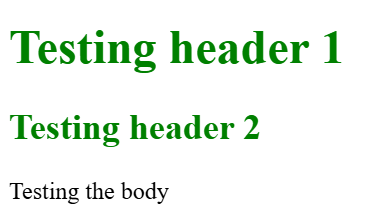
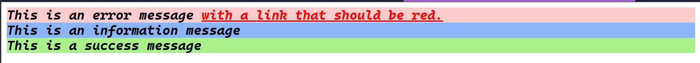
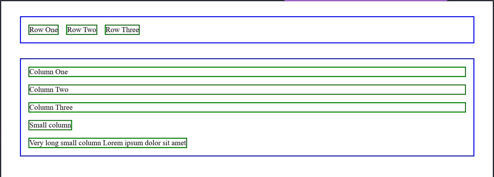
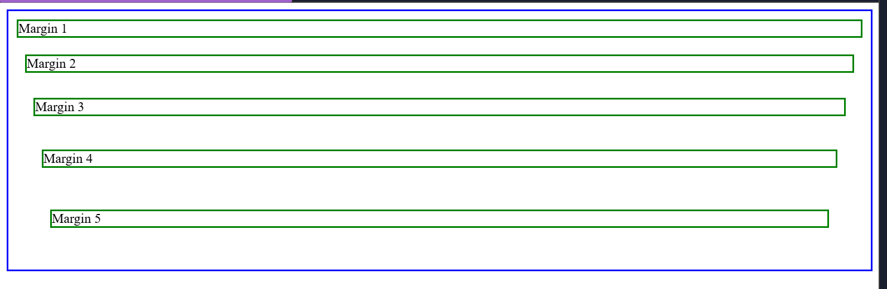

# Introducción a Sass

## 1. Ejercicios Google Docs

[Documento principal](practica-saas.md)

### Ejercicio 1

[Enunciado](practica-saas.md#ejercicio-1)

[Solución](practica-saas.md#ejercicio-1)

### Ejercicio 2

[Enunciado](practica-saas.md#ejercicio-2)

[Solución](ex-2)

### Ejercicio 3

[Enunciado](practica-saas.md#ejercicio-3)

[Solución](ex-3)

### Ejercicio 4

[Enunciado](practica-saas.md#ejercicio-4)

[Solución](ex-4)

### Ejercicio 5

[Enunciado](practica-saas.md#ejercicio-5)

[Solución](ex-5)

## Ejercicio Sass

Crear una página web usando Flex y Grid con el
layout: [Ejercicio Sass](https://docs.google.com/presentation/d/109-kZ1IC4dpyCugxcpBYrlnIPLIgZ7O1Vo3P8RvpRTQ/edit?slide=id.g62f478f5cd_0_13#slide=id.g62f478f5cd_0_13)

[Ejercicio sass](sass-ex)