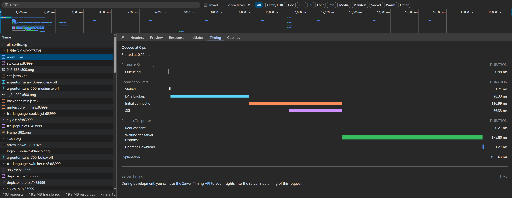
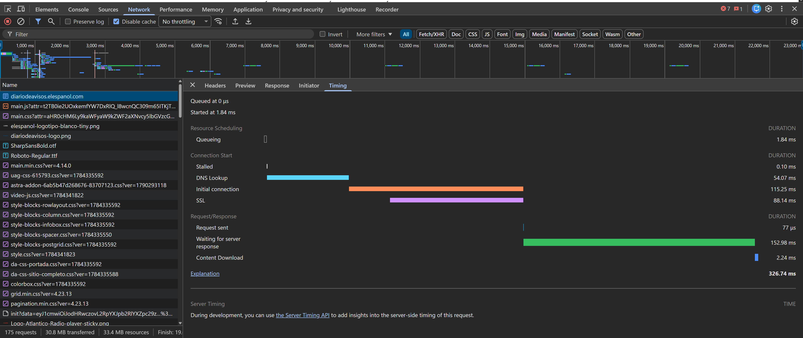

# Ejercicio 1:

Analizar el tránsito de red de las páginas:
[www.ull.es](http://www.ull.es), [https://diariodeavisos.elespanol.com/](https://diariodeavisos.elespanol.com/)
realizar en cada caso una tabla que indique los tipos de las distintas fases de
Red.

## ull.es

| Fase de Red                                   | Duración  |
|:----------------------------------------------|:----------|
| Queuing                                       | 0.99 ms   |
| Stalled                                       | 1.71 ms   |
| DNS Lookup                                    | 98.33 ms  |
| Initial connection                            | 116.99 ms |
| SSL                                           | 66.33 ms  |
| Request/Response: Request sent                | 0.27 ms   |
| Request/Response: Waiting for server response | 175.80 ms |
| Request/Response: Content Download            | 1.27 ms   |
| Tiempo Total                                  | 395.48 ms |

## diariodeavisos.elespanol.com

| Fase de Red                                   | Duración  |
|:----------------------------------------------|:----------|
| Queuing                                       | 1.84 ms   |
| Stalled                                       | 0.10 ms   |
| DNS Lookup                                    | 54.07 ms  |
| Initial connection                            | 115.25 ms |
| SSL                                           | 88.14 ms  |
| Request/Response: Request sent                | 77 µs     |
| Request/Response: Waiting for server response | 152.98 ms |
| Request/Response: Content Download            | 2.24 ms   |
| Tiempo Total                                  | 326.74 ms |

# Ejercicio 2:

Crea un parcial de definición de las variables para el color primario y
secundario y utilizarlo para definir estilos para el body y los títulos h1 h2.
Verifica que las variables se hayan aplicado correctamente.

[_colors.scss](src/styles/_colors.scss)

# Ejercicio 3:

Construye una hoja de estilos Sass para un sistema de mensajes de estado (como
alertas de éxito, error o información) que sea modular, DRY (Don't Repeat
Yourself) y fácil de mantener. Crea el estilo base en un parcial que no se
compile por sí solo, úsalos para definir estilos específicos para mensajes
informativos, de error y de éxito. El color del fondo debe ser acorde con lo que
representan. Además, los enlaces dentro del mensaje de error deben estar en
negrita. Comprueba que se transpila correctamente.

# Ejercicio 4:

Crea dos mixins, uno que permita establecer la dirección de un contenedor
flexbox y el otro que permita dar un tamaño específico en un elemento. Verifica
que transpila y funciona correctamente sobre algún ejemplo.

# Ejercicio 5:

Utiliza un bucle `@for` para generar 5 clases de espaciado llamadas `margin-1` a
`.margin-5`. Cada clase debe tener un `margin` que se incremente en `10px` por
cada iteración. Transpila el archivo y revisa el CSS generado.